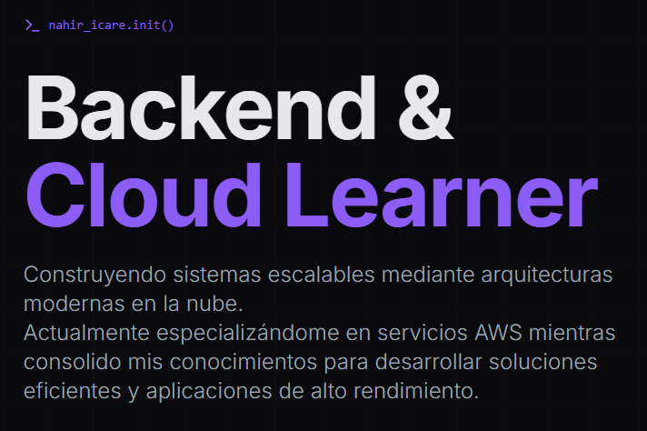

# My Portfolio



Este es el repositorio del código fuente de mi portafolio personal, donde exhibo mis proyectos, mi formación técnica y mis certificaciones.

## Tecnologías Utilizadas
Construido con un enfoque moderno y performante:

- **Lenguaje:** [TypeScript](https://www.typescriptlang.org/)
- **UI:** [React](https://react.dev/) v18.3.1
- **Bundler:** [Vite](https://vite.dev/)
- **Estilos:** [Tailwind CSS](https://tailwindcss.com/)
- **Componentes:** [Radix UI](https://www.radix-ui.com/), [Framer Motion](https://www.framer.com/motion/), [Recharts](https://recharts.org/), [MUI](https://mui.com/)

## Cómo correrlo localmente

1. **Clonar el repo:**
   ```bash
   git clone [https://github.com/nahiricare/portfolio.git]

2. **Instalar dependencias**
Podés usar npm o pnpm:
   ```bash
   npm install
  
3. **Ejecutar el entorno de desarrollo**
   ```bash
   npm run dev

## Licencia
Este proyecto es de código abierto. Siéntete libre de usarlo como referencia.

Dedicatedly made by Nahir Icare
